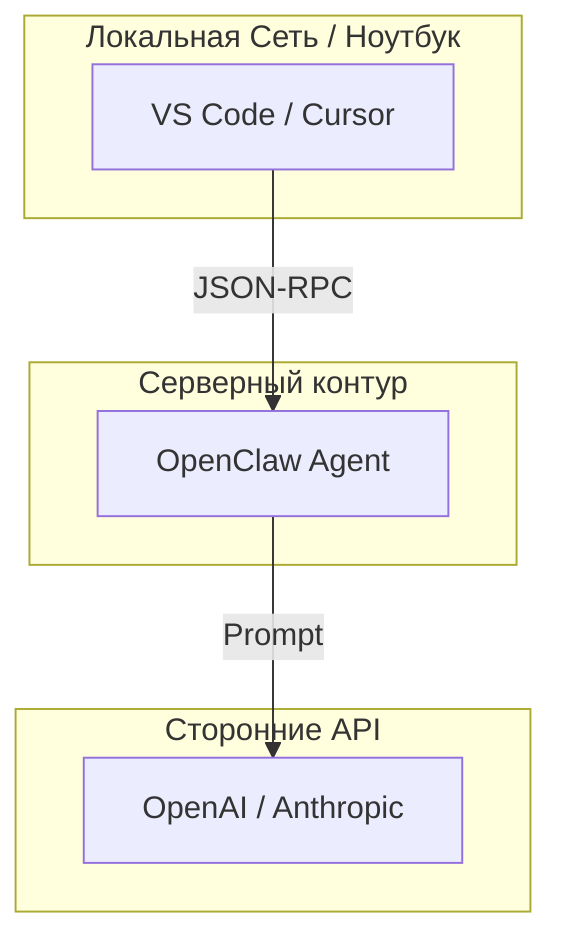

# Архитектура и FinOps Анализ

## 1. Схема Архитектуры
<!-- Вставьте сюда ваш Mermaid-код (Flowchart или Sequence Diagram) -->

## 2. Сравнительная Оценка FinOps (TCO)
<!-- Заполните данные по итогам расчета -->

**Спецификация:** 8 vCPU / 64 GB RAM / NVMe

1. **Enterprise Cloud (Yandex/Selectel):**
   - Цена в месяц: ... руб.
   
2. **Budget VPS (Лоукост):**
   - Цена в месяц: ... руб.
   
3. **Инженерное резюме:**
   - Почему Enterprise стоит кратно дороже и за что платит бизнес?
   - ...
