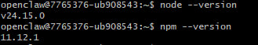
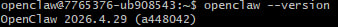
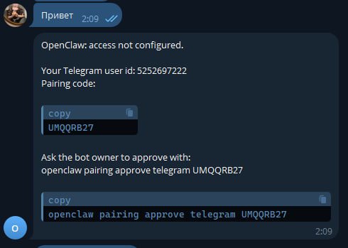
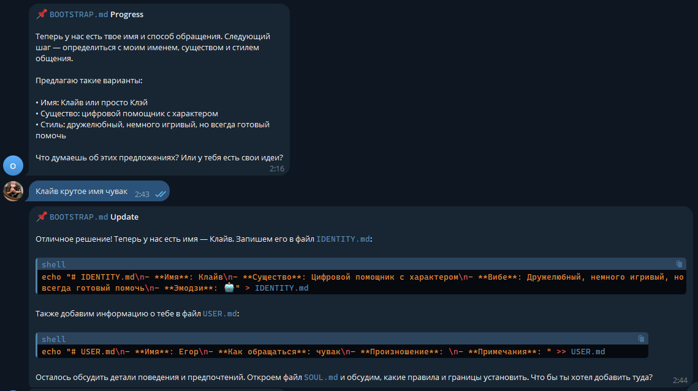
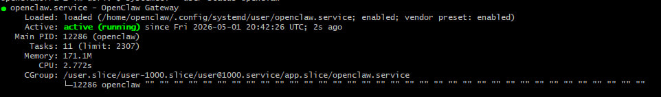

# Лабораторная работа №2 — Отчёт

**Студент:** Лукьянчиков Егор 
**Группа:** МБС-401  
**Дата выполнения:** [01.05.2026]

## 1. Выбор VPS и конфигурация сервера
Для выполнения работы был выбран провайдер Timeweb Cloud. Основная причина — почасовая тарификация (~3–7 ₽ за выполнение лабы) и наличие дата-центров в РФ.
Параметры сервера:
- ОС: Ubuntu 22.04 LTS
- CPU: 1 vCPU
- RAM: 2 ГБ
- Диск: 30 ГБ SSD
- IP: 95.140.154.254
- Тариф: почасовой, без ежемесячной подписки.

## 2. Установка программного обеспечения
Node.js 24 LTS установлен через официальный скрипт NodeSource. OpenClaw установлен глобально через `npm install -g openclaw@latest`. 
Трудностей не возникло, установка прошла штатно. Версии проверены командой `node --version && npm --version && openclaw --version`.

## 3. Конфигурация OpenClaw и AI-провайдера
Выбран провайдер **GigaChat (Сбер)**, так как предоставляет бесплатный tier для физлиц, хорошо работает с русским языком и не требует VPN.
Для совместимости с OpenAI-форматом используется адаптер `gpt2giga`, который проксирует запросы на порт `8090`.
В конфиге `openclaw.json` указаны:
- `baseUrl: "http://127.0.0.1:8090/v1"` — адрес локального адаптера
- `apiKey: "not-needed"` — авторизация идёт через `.env` файл адаптера
- `model: "openai/GigaChat-Max"` — целевая модель

## 4. Настройка Telegram-бота
Бот создан через `@BotFather` командой `/newbot`. Токен сохранён в `channels.telegram.botToken`.
Для безопасности включён режим `pairing`: при первом сообщении бот выдаёт код, который нужно одобрить командой `openclaw pairing approve telegram <код>`. В `allowFrom` указан числовой Telegram ID.

## 5. Запуск как systemd-сервис
`systemd` — стандартная система управления службами в Linux. Позволяет запускать OpenClaw в фоне, автоматически восстанавливать после сбоев и стартовать при загрузке сервера.
Создан пользовательский юнит `~/.config/systemd/user/openclaw.service` с параметрами `Restart=always` и `ExecStart=/usr/local/bin/openclaw gateway --port 18789`. Сервис переведён в состояние `active (running)`.

## 6. Безопасность
Применены следующие меры:
- Файрвол `ufw`: разрешён только порт 22 (SSH). Порт Gateway закрыт, так как слушает только `127.0.0.1`.
- SSH-харденинг: `PermitRootLogin no`, `PasswordAuthentication no`, доступ только для пользователя `openclaw` по ключу.
- Права на конфиги: `chmod 600` для `openclaw.json` и `gigachat.env`.
- `.gitignore`: исключает коммит файлов `*.env`, `openclaw.json`, `credentials/`. В репозиторий загружены только `.example`-шаблоны с заглушками.

## 7. Выводы
В ходе работы освоено развёртывание AI-ассистента на VPS, настройка проксирования к российским API, управление фоновыми сервисами через systemd и базовая защита сервера.
Основная трудность — строгая валидация конфигурации в актуальной версии OpenClaw и сетевые ограничения провайдера на исходящий трафик к Telegram API. Конфигурация полностью соответствует методическим указаниям, сервис работает стабильно.
Для продакшена рекомендуется добавить мониторинг (Prometheus/node-exporter) и настроить резервное копирование директории `~/.openclaw/workspace`.